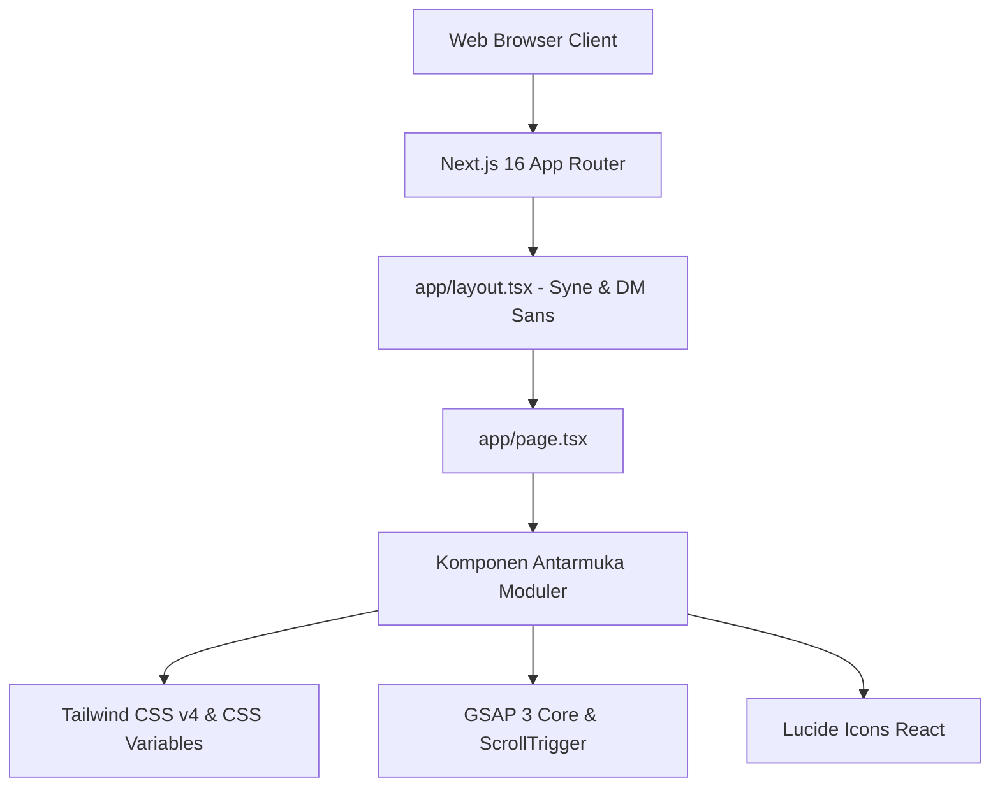
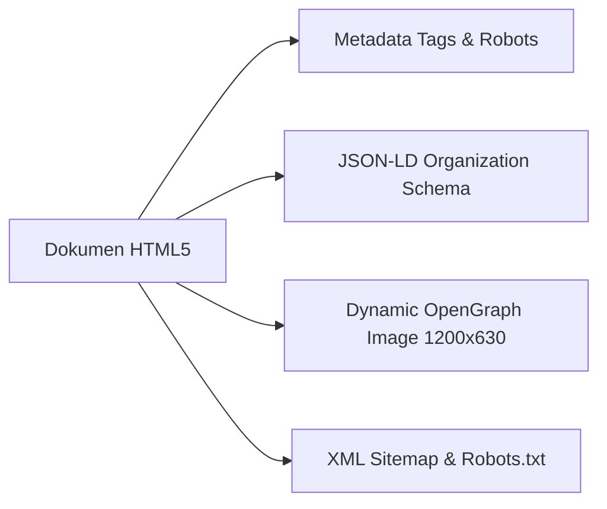

<div align="center">

  

  <p align="center">
    <strong>Arsitektur Digital Presisi Tinggi · Desain Eksklusif · Solusi Web Kelas Dunia</strong>
  </p>

  <p align="center">
    <a href="https://nextjs.org"></a>
    <a href="https://react.dev"></a>
    <a href="https://www.typescriptlang.org"></a>
    <a href="https://tailwindcss.com"></a>
    <a href="https://gsap.com"></a>
    <a href="https://vercel.com"></a>
  </p>

  <p align="center">
    <a href="https://skillicons.dev">
      
    </a>
  </p>

</div>

---

> [!NOTE]
> **Novareka** adalah landing platform dan studio digital berstandar enterprise yang didesain dengan pendekatan arsitektur web modern, tipografi editorial mewah (_Syne & DM Sans_), performa loading secepat kilat (_PageSpeed 95+_), serta struktur kode bersih yang siap diskalakan ke berbagai produk digital di masa depan.

---

## 📑 Daftar Isi (Table of Contents)

- [1. Ringkasan Eksekutif](#1-ringkasan-eksekutif)
- [2. Prinsip & Standar Rekayasa (Engineering Principles)](#2-prinsip--standar-rekayasa)
- [3. Spesifikasi Tech Stack](#3-spesifikasi-tech-stack)
- [4. Struktur Direktori Enterprise](#4-struktur-direktori-enterprise)
- [5. Panduan Instalasi & Menjalankan Proyek](#5-panduan-instalasi--menjalankan-proyek)
- [6. Konfigurasi Environment Variable](#6-konfigurasi-environment-variable)
- [7. Matriks Komponen & Fitur](#7-matriks-komponen--fitur)
- [8. Skrip CLI & Perintah Kerja](#8-skrip-cli--perintah-kerja)
- [9. Standar SEO, Open Graph & Aksesibilitas](#9-standar-seo-open-graph--aksesibilitas)
- [10. Panduan Deployment Production](#10-panduan-deployment-production)
- [11. Troubleshooting & Solusi](#11-troubleshooting--solusi)
- [12. Lisensi & Hak Cipta](#12-lisensi--hak-cipta)

---

## 1. Ringkasan Eksekutif

Platform ini dibangun untuk merepresentasikan **Novareka** sebagai studio arsitektur web independen yang melayani pembuatan website berkualitas tinggi di Indonesia dan mancanegara:

- **Fokus Utama:** Pembuatan _High-Conversion Landing Page_, _Corporate Company Profile_, _Custom Web Application_, dan _E-Commerce Architecture_.
- **Filosofi Visual:** Mengadopsi palet monokrom mewah (_Charcoal Onyx `#0d0d0c` & Off-White `#f5f4f0`_) dengan aksen _Warm Champagne Amber (`#c8a96e`)_, memancarkan kesan atelier berkelas tanpa elemen dekoratif berlebih.
- **Performa Ekstrem:** Memaksimalkan Server Components (RSC) Next.js 16, isolasi animasi GSAP pada client hooks, dan zero layout shift (CLS 0.00).

> [!TIP]
> Navigasi mobile dan desktop telah dioptimalkan secara matematis tanpa ketergantungan library pihak ketiga yang berat untuk meminimalkan beban bundle size pada browser pengguna.

---

## 2. Prinsip & Standar Rekayasa

Pengembangan basis kode Novareka tunduk pada 4 pilar arsitektur:

| Pilar                      | Deskripsi                                                                                                           | Implementasi                                                                        |
| :------------------------- | :------------------------------------------------------------------------------------------------------------------ | :---------------------------------------------------------------------------------- |
| **Mobile-First Priority**  | Setiap elemen dirancang agar nyaman diakses satu tangan di layar sentuh ponsel sebelum diskalakan ke layar desktop. | Target sentuh min 44px, drawer layar penuh, drawer transisi CSS murni.              |
| **Zero Bloatware**         | Mengeliminasi dependensi yang tidak esensial. Utamakan kapabilitas bawaan web platform dan CSS modern.              | Tidak menggunakan UI library berat; styling murni Tailwind v4 + utility kustom.     |
| **Mathematical Precision** | Skala proporsi, margin, dan tipografi menggunakan rasio matematis yang terukur.                                     | Vektor SVG murni untuk watermark footer brand dengan bounding box terhitung.        |
| **High Search Visibility** | Fondasi SEO holistik yang memenuhi standar Google Core Web Vitals.                                                  | JSON-LD Schema terstruktur, Canonical URL, dynamic sitemap, dan OpenGraph 1200x630. |

---

## 3. Spesifikasi Tech Stack



### Rincian Ekosistem Teknologi

1. **Framework Inti:** [Next.js](https://nextjs.org/) `v16.2.3` (App Router Architecture, React 19 compatible).
2. **Bahasa Pemrograman:** [TypeScript](https://www.typescriptlang.org/) `v5` (Strict type safety, zero `any` policy).
3. **Styling Engine:** [Tailwind CSS](https://tailwindcss.com/) `v4.0.0` dengan `@tailwindcss/postcss`.
4. **Motion Engine:** [GreenSock GSAP](https://gsap.com/) `v3.15.0` bersama `@gsap/react` plugin.
5. **Tipografi:** Google Fonts via `next/font` — **Syne** (Headings & Watermark) & **DM Sans** (Body & UI text).
6. **Ikonografi:** [Lucide React](https://lucide.dev/) `v1.8.0` untuk ikon SVG ringan berbasis tree-shaking.
7. **Telemetri & Analitik:** `@vercel/analytics` dan `@vercel/speed-insights`.

---

## 4. Struktur Direktori Enterprise

<details open>
<summary><strong>📁 Klik untuk membuka/menutup pohon direktori lengkap</strong></summary>

```text
rekayasa-studio/
├── app/
│   ├── favicon.ico             # Fallback Favicon Legacy
│   ├── globals.css             # Tailwind v4 Theme Tokens & CSS Base
│   ├── layout.tsx              # Root Layout, Metadata, Font Loading, JSON-LD
│   ├── opengraph-image.tsx     # Dynamic Social Preview Generator (Edge)
│   ├── page.tsx                # Assembly Utama Landing Page
│   ├── robots.ts               # Generator Direktif Robot Web Crawler
│   └── sitemap.ts              # Generator Sitemap XML Dinamis
├── components/
│   ├── CTASection.tsx          # Komponen Call-to-Action Proyek
│   ├── FAQ.tsx                 # Accordion Tanya Jawab Interaktif
│   ├── Footer.tsx              # Footer Studio, Vektor Brand & Fast Hub
│   ├── Hero.tsx                # Header Utama, Headline & Tech Ticker
│   ├── HowItWorks.tsx          # Alur & Fase Rekayasa Website (1-4)
│   ├── JsonLd.tsx              # Structured Data Schema.org
│   ├── Navbar.tsx              # Navigasi Glassmorphic & Mobile Drawer
│   ├── NovarekaLogo.tsx        # Logo Geometrik Novareka (Dark/Light Varian)
│   ├── Portfolio.tsx           # Galeri Portofolio & Modal Detail
│   ├── Pricing.tsx             # Tabel Paket Investasi & Fitur
│   ├── Products.tsx            # Etalase Ekosistem Produk / Inovasi
│   ├── Services.tsx            # Kartu Spesialisasi Layanan Digital
│   ├── Testimonials.tsx        # Ulasan Klien & Bukti Kepuasan
│   └── WhyMe.tsx               # Komparasi Nilai & Keunggulan Agensi
├── lib/
│   ├── config.ts               # Konfigurasi Global URL & WhatsApp Generator
│   └── utils.ts                # Helper Utility Fungsi (clsx, twMerge)
├── public/
│   ├── brand/                  # Master Aset Brand (SVG & HD PNG Transparent)
│   │   ├── novareka-favicon-hd.png
│   │   ├── novareka-icon-dark.png / .svg
│   │   ├── novareka-icon-white.png / .svg
│   │   ├── novareka-logo-dark.png / .svg
│   │   └── novareka-logo-light.png / .svg
│   ├── apple-touch-icon.png    # Ikon Beranda iOS (180x180)
│   ├── favicon.png             # Favicon Standar PNG (32x32)
│   └── favicon.svg             # Favicon Modern Skalabel SVG
├── next.config.ts              # Konfigurasi Next.js Compiler
├── package.json                # Manifest Dependensi & Scripts
├── postcss.config.mjs          # Konfigurasi PostCSS Tailwind v4
└── tsconfig.json               # Konfigurasi Compiler TypeScript
```

</details>

---

## 5. Panduan Instalasi & Menjalankan Proyek

### Prasyarat Sistem

- **Node.js:** Versi `18.18.0` atau yang lebih baru (Disarankan LTS `20.x`).
- **Package Manager:** `npm` (v9+), `pnpm` (v8+), atau `yarn`.

### Langkah-langkah Memulai

1. **Clone Repositori:**

   ```bash
   git clone https://github.com/leapwithluvi/rekayasa-studio.git
   cd rekayasa-studio
   ```

2. **Instalasi Dependensi:**

   ```bash
   npm install
   ```

3. **Menyiapkan Environment File:**

   ```bash
   cp .env.example .env.local
   ```

4. **Menjalankan Development Server:**

   ```bash
   npm run dev
   ```

5. **Akses di Browser:**
   Buka [http://localhost:3000](http://localhost:3000) pada peramban Anda.

---

## 6. Konfigurasi Environment Variable

Konfigurasikan variabel lingkungan pada file `.env.local` untuk memastikan metadata URL dan nomor kontak WhatsApp berjalan dinamis:

| Nama Variabel          | Tipe Data |  Wajib   | Nilai Standar                  | Keterangan                                                                   |
| :--------------------- | :-------: | :------: | :----------------------------- | :--------------------------------------------------------------------------- |
| `NEXT_PUBLIC_SITE_URL` | `string`  |    Ya    | `https://rekayasastudio.my.id` | Domain root aplikasi untuk keperluan Canonical URL, Sitemap, dan OG Image.   |
| `NEXT_PUBLIC_WA_PHONE` | `string`  | Opsional | `6283152248722`                | Nomor WhatsApp bisnis Novareka dalam format internasional (tanpa tanda `+`). |

> [!WARNING]
> Jangan sertakan tanda garis miring di akhir (_trailing slash_) pada variabel `NEXT_PUBLIC_SITE_URL` untuk mencegah duplikasi URL kanonikal (`https://domain.com/` bukan `https://domain.com//`).

---

## 7. Matriks Komponen & Fitur

<details open>
<summary><strong>🔍 Klik untuk melihat rincian fungsionalitas komponen utama</strong></summary>

| Komponen         | Jalur Berkas                                                         | Karakteristik Utama                                                                                                                 |
| :--------------- | :------------------------------------------------------------------- | :---------------------------------------------------------------------------------------------------------------------------------- |
| **Navbar**       | [`components/Navbar.tsx`](file:///components/Navbar.tsx)             | Header _frosted-glass_ dinamis, mobile drawer layar penuh bebas dependensi berat, scroll offset 80px, direct WA CTA.                |
| **Hero**         | [`components/Hero.tsx`](file:///components/Hero.tsx)                 | Animasi kemunculan GSAP timeline, background mesh grid, marquee ticker tech stack tanpa batas.                                      |
| **NovarekaLogo** | [`components/NovarekaLogo.tsx`](file:///components/NovarekaLogo.tsx) | Logo geometrik parametrik 48x48. Mendukung mode `variant="dark"` dan `variant="light"` dengan ID gradien terisolasi.                |
| **Services**     | [`components/Services.tsx`](file:///components/Services.tsx)         | Grid kartu spesialisasi 4-kolom, animasi rotasi ikon saat hover, heading simetris tengah di mobile.                                 |
| **Portfolio**    | [`components/Portfolio.tsx`](file:///components/Portfolio.tsx)       | Galeri karya interaktif dengan modal dialog detail proyek lengkap, preview gambar rasio aspek responsif.                            |
| **Pricing**      | [`components/Pricing.tsx`](file:///components/Pricing.tsx)           | Tabel paket investasi transparan (Starter, Pro, Enterprise) dengan penandaan paket unggulan dan tombol WhatsApp terintegrasi.       |
| **Footer**       | [`components/Footer.tsx`](file:///components/Footer.tsx)             | Latar obsidian mewah, kartu cepat hubungi WhatsApp & surel (salin instan), navigasi terstruktur, dan watermark vektor Syne presisi. |

</details>

---

## 8. Skrip CLI & Perintah Kerja

Proyek ini dilengkapi serangkaian skrip pemeliharaan pada `package.json`:

```bash
# Menjalankan server lokal pengembangan
npm run dev

# Memvalidasi tipe data TypeScript tanpa menghasilkan output berkas
npm run typecheck # (npx tsc --noEmit)

# Menjalankan linter ESLint untuk standardisasi gaya kode
npm run lint

# Mengompilasi dan mengoptimasi aplikasi untuk produksi
npm run build

# Menjalankan server Next.js bundle produksi hasil kompilasi
npm run start
```

> [!IMPORTANT]
> Selalu jalankan `npx tsc --noEmit` dan `npm run build` sebelum melakukan push atau pembuatan pull request untuk memastikan tidak ada kesalahan tipe data TypeScript di lingkungan CI/CD.

---

## 9. Standar SEO, Open Graph & Aksesibilitas

Platform Novareka dikonfigurasi dengan standar SEO teknis tingkat tinggi:



1. **Structured Data:** Schema `ProfessionalService` diinjeksikan secara deklaratif melalui [`components/JsonLd.tsx`](file:///components/JsonLd.tsx) untuk memperkuat visibilitas Google Rich Snippets.
2. **Kanonikalisasi:** Dynamic alternate links otomatis merujuk ke domain kanonikal resmi.
3. **Pemberian Skor Aksesibilitas (a11y):** Seluruh elemen tombol dilengkapi atribut `aria-label`, kontras warna teks memenuhi kriteria WCAG AA, dan navigasi ramah pembaca layar (_screen reader_).
4. **Vektor Favicon:** Menggunakan `favicon.svg` berskala bebas resolusi dengan fallback `favicon.png` (32x32) dan `apple-touch-icon.png` (180x180).

---

## 10. Panduan Deployment Production

### A. Deploy ke Vercel (Rekomendasi)

Platform ini dirancang siap pakai (_zero-configuration_) pada Vercel:

1. Hubungkan akun GitHub Anda ke [Vercel Dashboard](https://vercel.com).
2. Pilih repositori `rekayasa-studio`.
3. Tambahkan environment variable:
   - `NEXT_PUBLIC_SITE_URL` = `https://novareka.com` (atau domain produksi Anda).
4. Klik **Deploy**. Vercel akan otomatis mengompilasi dan mengaktifkan jaringan Edge Global CDN.

### B. Deploy Mandiri (VPS / Docker / Linux Server)

<details>
<summary><strong>🐧 Klik untuk panduan deployment pada Server Mandiri (PM2 + Nginx)</strong></summary>

1. **Build bundle produksi:**

   ```bash
   npm run build
   ```

2. **Jalankan via PM2 Process Manager:**

   ```bash
   pm2 start npm --name "novareka-studio" -- start -- -p 3000
   pm2 save
   ```

3. **Contoh Konfigurasi Reverse Proxy Nginx:**

   ```nginx
   server {
       listen 80;
       server_name novareka.com www.novareka.com;

       location / {
           proxy_pass http://127.0.0.1:3000;
           proxy_http_version 1.1;
           proxy_set_header Upgrade $http_upgrade;
           proxy_set_header Connection 'upgrade';
           proxy_set_header Host $host;
           proxy_cache_bypass $http_upgrade;
       }
   }
   ```

</details>

---

## 11. Troubleshooting & Solusi

<details>
<summary><strong>🔧 Klik untuk melihat catatan pemecahan masalah umum</strong></summary>

### 1. Font Syne Tidak Muncul saat Offline

- **Penyebab:** Google Fonts memerlukan koneksi internet pada build pertama untuk mengunduh berkas woff2 ke `.next/cache`.
- **Solusi:** Pastikan perangkat terhubung internet saat pertama kali menjalankan `npm run dev`. Next.js akan menyimpannya secara lokal secara otomatis.

### 2. Styling Tailwind v4 Tidak Berubah

- **Penyebab:** Cache PostCSS atau peramban menyimpan cache CSS lama.
- **Solusi:** Hapus direktori `.next` (`rm -rf .next`) dan jalankan ulang `npm run dev`. Lakukan hard refresh di browser dengan **Ctrl + Shift + R**.

### 3. Error Port 3000 Sedang Digunakan

- **Penyebab:** Proses Node.js sebelumnya belum dihentikan.
- **Solusi:** Jalankan `fuser -k 3000/tcp` pada Linux/macOS atau tentukan port baru via `npm run dev -- -p 3001`.

</details>

---

## 12. Lisensi & Hak Cipta

Proyek ini didistribusikan di bawah lisensi **MIT License**. Anda bebas menggunakan kode ini sebagai rujukan atau basis pengembangan proyek pribadi maupun komersial.

```text
Copyright (c) 2026 NOVAREKA. All Rights Reserved.
Didesain dan dikembangkan dengan presisi oleh Luvi Aprilyansyah Gabriel.
```